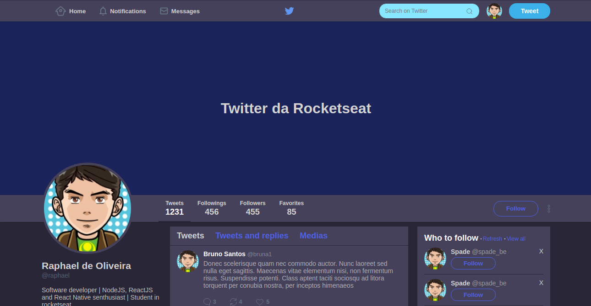

<h1 align="center">
    
</h1>

<h3 align="center">
  Extras: Display flex
</h3>

  

  

  

  

# Normal version

<h1 align="center">
    
</h1>

# Dracula version

<h1 align="center">
    
</h1>
